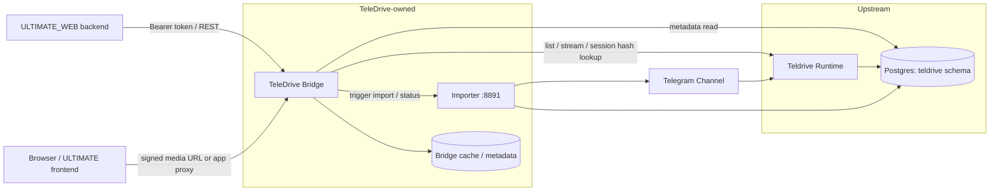
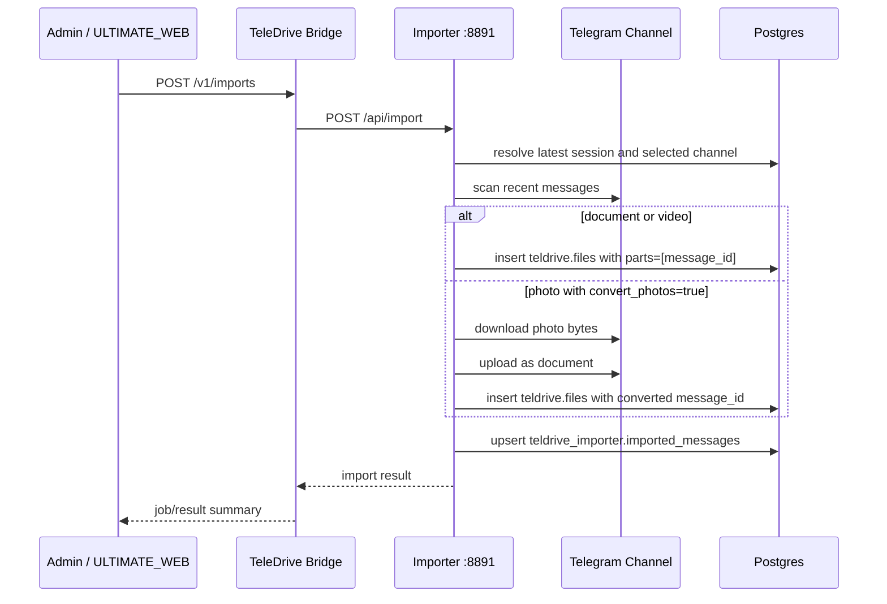
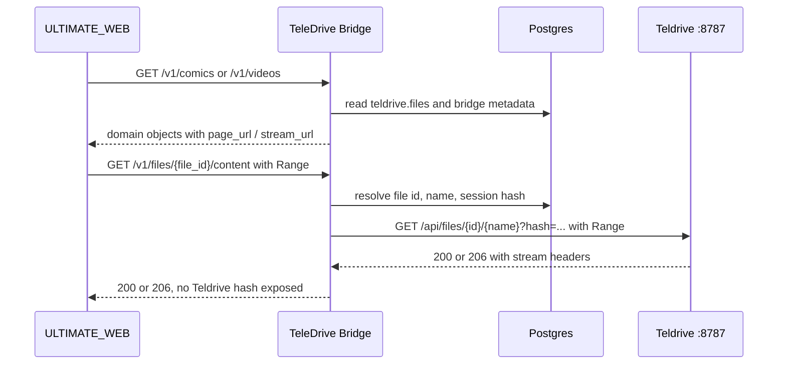

# TeleDrive 架构设计

本文描述 TeleDrive 在当前已跑通的 `Teldrive + importer + bridge + demo` 基线之上，如何演进为可接入 `ULTIMATE_WEB` 的 Bridge 架构。目标是让 ULTIMATE_WEB 只感知稳定的业务 API，不直接依赖 Telegram、Teldrive 会话、Teldrive 数据库结构或运行时目录。

## 当前基线

当前工作区已经具备四个可运行部件：

| 部件 | 位置 | 端口 | 职责 |
| --- | --- | --- | --- |
| Teldrive runtime | `run/teldrive` | `8787 -> 8080` | 使用上游 `ghcr.io/tgdrive/teldrive:latest`，提供 Telegram 登录、文件管理、`/api/files` 列表和 Range 流式读取。 |
| Teldrive importer | `cmd/teledrive-importer` | `8891` | 扫描 Teldrive 选中频道的 Telegram 历史消息，把 `document` / `video` 登记进 `teldrive.files`，把普通 `photo` 下载后重新上传为 document 再登记。 |
| TeleDrive Bridge | `cmd/teledrive-bridge` | `8892` | 暴露 `/v1/catalog/items`、`/v1/files/{id}/content`、`/v1/imports`，隐藏 session hash 并透传 `Range`。 |
| Legacy demo gallery | `run/demo` | `8890` | 早期 Node demo，用于对照验证图片/视频浏览效果；正式集成应使用 Bridge。 |

关键事实：

- Teldrive 数据库存储在 `run/teldrive/postgres_data`，核心表包括 `teldrive.files`、`teldrive.sessions`、`teldrive.channels`。
- importer 自有幂等表是 `teldrive_importer.imported_messages`，避免重复登记同一频道消息。
- importer 默认导入目录是 `/root/Telegram Imports`，当前是一个可用的媒体入口点，不是最终业务目录模型。
- Bridge 和 demo 均已验证浏览器不需要接触 Teldrive session hash，后端代理可保留视频播放所需的 `Range`、`Content-Range`、`Accept-Ranges` 等语义。

## 架构原则

1. Teldrive 是上游依赖，不是 ULTIMATE_WEB 的业务模块。TeleDrive 不把漫画、视频、推荐、用户权限等业务语义写进 Teldrive。
2. Bridge 是唯一集成面。ULTIMATE_WEB 只调用 TeleDrive Bridge；Bridge 再选择读 Teldrive HTTP API、Teldrive 数据库或 importer API。
3. 会话与 hash 不出 Bridge。Teldrive 的 `access_token` cookie、session hash、Telegram session string 都不得返回给浏览器或 ULTIMATE_WEB 前端。
4. 当前 direct DB 读写是 MVP 现实，不作为长期公共合约。生产阶段要把 Teldrive schema 访问收敛到 Bridge 内部适配层，并用兼容测试保护。
5. 所有业务 ID 对外保持 opaque。Bridge 可以内部保存 Teldrive file id、path、channel id、message id，但 API consumer 不应依赖这些字段可解析。

## Teldrive 的位置

本项目中 Teldrive 应被放在两个层次：

| 形态 | 位置 | 用法 |
| --- | --- | --- |
| 运行时依赖 | `run/teldrive/docker-compose.yml` 的 `teldrive` 服务 | MVP 和本地开发使用上游镜像运行 Teldrive。后续生产应固定镜像 tag 或固定自建镜像 digest。 |
| 上游源码镜像/子库 | `third_party/teldrive` | 作为只读上游参考和必要补丁基线，当前 remote 指向 `https://github.com/tgdrive/teldrive.git`，本地 HEAD 为 `d400a2d`。 |

推荐治理方式：

- `third_party/teldrive` 保持接近上游，默认不承载 TeleDrive 业务代码。
- 如果必须修改 Teldrive，应优先做通用能力补丁，例如稳定 API、bugfix、配置项，而不是加入 ULTIMATE_WEB 私有路由。
- 需要长期维护补丁时，使用 fork 或 patch 队列记录差异，并在 Bridge 中保留对上游版本的兼容适配。
- Bridge 对 Teldrive 的依赖通过 `TeldriveClient`、`TeldriveRepository` 之类的内部接口隔离，避免 ULTIMATE_WEB 代码直接 import 或查询 Teldrive schema。

## 目标拓扑



Bridge 不是简单反向代理，而是把 Teldrive 的“网盘文件”投影成 ULTIMATE_WEB 可消费的“漫画、章节、页面、视频、缩略图、播放源”。

## 模块边界

### 1. Bridge API 层

职责：

- 暴露 `/v1/*` REST API。
- 处理 ULTIMATE_WEB 的 `Authorization: Bearer <token>`。
- 生成 request id、统一错误格式、分页和缓存头。
- 对媒体内容支持 `GET` 和 `HEAD`，透传 Range。

不做：

- 不直接包含 Telegram MTProto 逻辑。
- 不暴露 Teldrive session hash。
- 不把 ULTIMATE_WEB 内部 DTO 原样泄露为 Bridge 内部模型。

### 2. Catalog Projection

职责：

- 从 Teldrive 文件树或 DB 查询结果中识别媒体。
- 将目录和文件名投影为领域对象：
  - `Comic`
  - `Chapter`
  - `Page`
  - `VideoAsset`
  - `FileAsset`
- 负责排序、去重、扩展名过滤、标题清洗和默认缩略图选择。

建议目录约定：

```text
/Library/Comics/{series}/{chapter}/{001.jpg}
/Library/Videos/{collection}/{video-file.mp4}
/Telegram Imports/{flat-imported-file}
```

`/Telegram Imports` 是当前 importer 的默认落点。MVP 可以直接从这里列出 image/video；接入 ULTIMATE_WEB 前建议增加 Bridge 侧的映射规则或人工 override，把 flat files 归并到漫画/视频业务结构。

### 3. Teldrive Access Layer

职责：

- 封装 Teldrive HTTP API：
  - `GET /api/files?operation=list`
  - `GET /api/files/{id}`
  - `GET /api/files/{id}/{name}?hash=...`
- 封装当前必要的 DB 查询：
  - `teldrive.files`
  - `teldrive.sessions`
  - `teldrive.channels`
- 把 Teldrive file id、session hash、user id、channel id 留在内部。

MVP 可以沿用 demo 的 DB 查询方式来获取 catalog，沿用 Teldrive streaming API 来读内容。生产阶段应逐步提高 HTTP API 使用比例，或把 DB 查询集中在一个兼容层并补测试。

### 4. Import Orchestration

职责：

- 封装 `teledrive-importer` 的接口：
  - `GET /health`
  - `GET /api/status`
  - `POST /api/import`
- 提供 Bridge 自己的 import job API。
- 将同步 importer 结果包装成异步 job 语义，方便 ULTIMATE_WEB 后续轮询。

当前 importer 能力：

- `document` / `video`：登记原 Telegram message id 到 `teldrive.files.parts`。
- `photo`：下载普通照片，重新上传成 document，再登记。
- 幂等：通过 `teldrive_importer.imported_messages(channel_id, original_msg_id)` 防重复。

### 5. Media Proxy

职责：

- 以 `/v1/files/{file_id}/content` 对外提供文件内容。
- 内部请求 Teldrive `/api/files/{id}/{filename}?hash=...`。
- 透传请求头：`Range`、必要的 `User-Agent`。
- 透传响应头：`Accept-Ranges`、`Content-Type`、`Content-Length`、`Content-Range`、`ETag`、`Last-Modified`。
- 支持 `download=1`。

这个模块是视频播放和漫画图片加载的核心。它也是安全边界：浏览器只看见 Bridge URL。

### 6. Bridge Metadata Store

MVP 可以不引入新数据库表，只读 Teldrive DB。生产阶段建议新增独立 schema，例如 `teledrive_bridge`：

| 表 | 用途 |
| --- | --- |
| `sources` | 记录 Teldrive 实例、默认 user/channel、目录根。 |
| `catalog_overrides` | 把 flat import 文件归类到漫画、章节、视频集合。 |
| `import_jobs` | 记录 Bridge 侧任务状态、幂等键、触发者、错误。 |
| `thumbnails` | 记录图片缩略图、视频 poster、生成状态。 |
| `asset_aliases` | 保存对外 opaque id 与内部 Teldrive file id 的映射。 |

独立 schema 的价值是把 ULTIMATE_WEB 业务视图与 Teldrive 上游 schema 解耦。

## 数据流

### 导入流



### 浏览和播放流



## ULTIMATE_WEB 接入边界

ULTIMATE_WEB 侧应新增一个很薄的 Bridge adapter：

- 配置项：`bridge_base_url`、`api_key`、默认 source、超时、是否启用导入按钮。
- 漫画入口：调用 Bridge 的 comics/chapters/pages API，把返回映射到 ULTIMATE_WEB 现有阅读器需要的 DTO。
- 视频入口：调用 Bridge 的 videos/detail API，把 `stream_url` 交给现有播放器或后端代理。
- 搜索入口：调用 Bridge 的 catalog/search API，而不是直接查 Teldrive DB。

ULTIMATE_WEB 不应：

- 连接 `run/teldrive` 的 Postgres。
- 拼接 Teldrive `/api/files/{id}/{name}?hash=...`。
- 管理 Telegram session、Teldrive cookie、频道 message id。
- 假设 Bridge 返回的 opaque id 可以解析。

## MVP 路线

### 阶段 0：已完成基线

- Teldrive Docker 运行在 `run/teldrive`。
- importer 由 `cmd/teledrive-importer` 构建，端口 `8891`。
- Bridge 由 `cmd/teledrive-bridge` 构建，端口 `8892`。
- demo 运行在 `run/demo`，端口 `8890`，作为 legacy 对照工具。
- 已验证 document/video 登记、photo 转 document、Bridge catalog、Bridge Range 代理。

### 阶段 1：Bridge MVP（当前已落地）

目标是把 demo 的能力产品化为 Bridge，当前已有 Go 版 MVP：

- 新增独立 Bridge 服务，暴露 `/v1/catalog/items` 和 `/v1/files/{id}/content`。
- Bridge 读取 `teldrive.files` 获取 image/video 列表。
- Bridge 从 `teldrive.sessions` 获取服务端可用 session hash，媒体代理隐藏该 hash。
- Bridge 包装 importer 的 `POST /api/import` 和 `GET /api/status`。
- 使用单个 API key 给 ULTIMATE_WEB 后端调用。
- 先支持 flat catalog，能展示和播放 `/Telegram Imports` 下的图片和视频。

验收：

- ULTIMATE_WEB 后端可以通过 Bridge 获取列表。
- 浏览器可以通过 Bridge URL 加载图片和 seek 视频。
- 重复 import 不产生重复 file。
- Bridge 日志不打印 session hash 或 Telegram session string。

### 阶段 2：ULTIMATE_WEB 领域适配

目标是让 ULTIMATE_WEB 看到漫画/视频业务对象：

- 增加 `/v1/comics`、`/v1/chapters/{id}/pages`、`/v1/videos`、`/v1/videos/{id}`。
- 支持目录约定和最小 override，把 flat import 文件归入作品、章节或视频集合。
- ULTIMATE_WEB 新增 Bridge adapter，只改接入层，不重写阅读器和播放器。
- 增加 page sorting 规则：自然数字排序优先，文件名排序兜底。
- 缩略图 MVP：图片直接使用原图 URL；视频 poster 可返回 `null`。

验收：

- ULTIMATE_WEB 能打开一个 Telegram 来源漫画章节。
- ULTIMATE_WEB 能播放一个 Telegram 来源视频并支持拖动。
- Bridge API 文档和返回结构固定，后续只做兼容扩展。

### 阶段 3：可靠性和运维硬化

目标是从本地 MVP 进入可长期运行状态：

- 固定 Teldrive 上游版本和镜像 digest。
- Bridge 增加 `teledrive_bridge` schema，保存 source、catalog override、job、thumbnail 状态。
- Import job 改为异步队列，支持 idempotency key、取消、重试和增量扫描。
- importer 增加更明确的 offset/checkpoint 策略，避免每次扫大量历史。
- 加入 OpenAPI 规范、契约测试、Teldrive schema 兼容测试。
- 加入结构化日志、Prometheus 指标、错误码分层、超时和熔断。
- 对 Telegram FloodWait、网络抖动、Teldrive 5xx 做重试与退避。

验收：

- 重启 Bridge/importer 不丢 job 状态。
- Teldrive 升级前可以跑兼容测试。
- 单文件大视频 seek 和连续漫画翻页有稳定延迟指标。

### 阶段 4：生产能力

目标是面向多来源、多用户和可观测生产环境：

- 多 Teldrive source、多 Telegram account/channel。
- 细粒度权限：source、collection、asset 级授权。
- 缩略图服务：图片尺寸变体、视频 poster 抽帧、缓存清理。
- CDN 或反向代理缓存策略，但不能缓存私密授权错误。
- 只读 WebDAV 或 SDK 作为非 ULTIMATE_WEB 消费入口。
- 备份和恢复：Teldrive Postgres、Bridge metadata、配置密钥。
- 上游治理：定期同步 `third_party/teldrive`，记录版本、变更、补丁和回滚方案。

## 风险与应对

| 风险 | 影响 | 应对 |
| --- | --- | --- |
| Teldrive schema 变更 | importer 和 Bridge DB 查询失效 | 把 DB 查询集中在 access layer，固定上游版本，补 schema 契约测试。 |
| Telegram API 限制或 FloodWait | 导入和流媒体不稳定 | 控制并发，增加退避、缓存、任务速率限制，避免批量滥用。 |
| session/hash 泄露 | 用户账号风险 | Bridge 统一代理，禁止前端和 ULTIMATE_WEB 接触 Teldrive hash，日志脱敏。 |
| flat import 无业务结构 | ULTIMATE_WEB 漫画/视频体验弱 | 阶段 2 引入目录约定和 `catalog_overrides`。 |
| 视频缩略图缺失 | 列表体验一般 | MVP 允许 `thumbnail_url=null`，生产阶段异步生成 poster。 |
| 直接修改 Teldrive | 后续上游升级困难 | 保持 Teldrive 为上游依赖，业务逻辑放 Bridge，补丁保持通用和最小。 |

## 非目标

- MVP 不重写 Telegram MTProto 文件读取器。
- MVP 不把 Teldrive 嵌入 ULTIMATE_WEB 进程。
- MVP 不做多租户权限系统。
- MVP 不保证 WebDAV、上传管理、全文搜索、视频转码。
- Bridge API 不承诺兼容 Teldrive 原生 API，只承诺兼容本文和 `bridge-api.md` 定义的对外合约。
