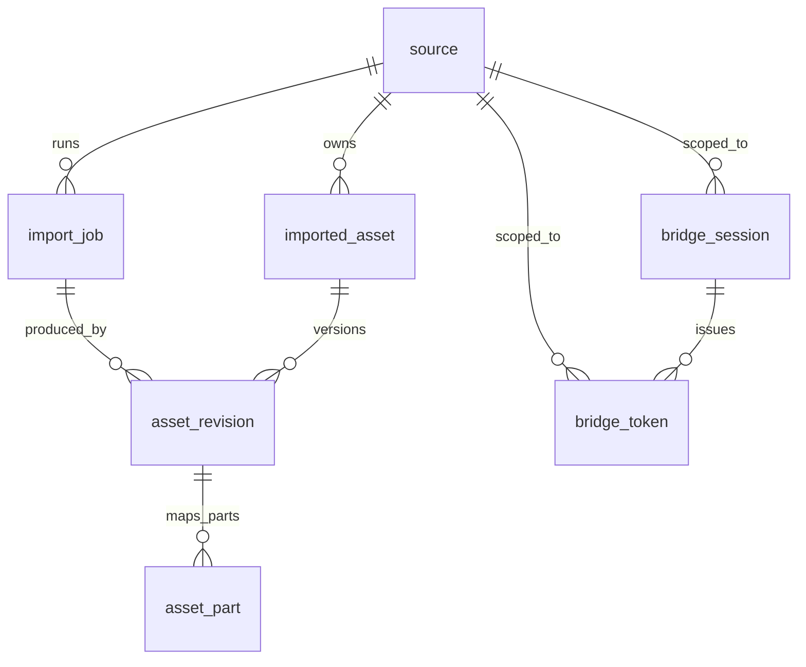

# TeleDrive 数据库层设计

## 目标

任务 2 的数据库层只做 TeleDrive 自有元数据，不接管 Teldrive 的内部表。当前 Teldrive 仍是后端存储和流式读取实现，importer 仍可继续写：

- `teldrive.files`
- `teldrive_importer.imported_messages`

新增 schema 为 `tele_drive`，用于在未来把 Teldrive 当成一个后端数据源/子库来管理。迁移只创建新 schema、新表和索引，不修改 `teldrive.*` 或 `teldrive_importer.*`，因此不会破坏现有 demo/importer 数据。

## 设计原则

1. `teldrive` schema 视为第三方边界：不向 `teldrive.files`、`teldrive.sessions`、`teldrive.channels` 添加外键、触发器或列。
2. TeleDrive 自有表用松耦合 ID 关联 Teldrive：保存 `teldrive_file_id`、`teldrive_user_id`、`teldrive_channel_id`、Telegram message id 等可校验字段。
3. importer 现有幂等标记表保持有效：`tele_drive.imported_asset` 与 `asset_revision/asset_part` 能表达同一条导入结果，但不要求 importer 立即迁移。
4. token/session 不存明文：`bridge_token` 只保存 token hash；`bridge_session` 保存 session secret 引用和摘要，不保存 Telegram/Teldrive 原始 session。
5. 状态字段使用 `text` 而不是 PostgreSQL enum，便于后续扩展状态机。

## 迁移文件

Postgres migration:

```text
db/migrations/20260522130000_create_tele_drive_core.sql
```

它创建：

- `tele_drive.source`
- `tele_drive.import_job`
- `tele_drive.imported_asset`
- `tele_drive.asset_revision`
- `tele_drive.asset_part`
- `tele_drive.bridge_session`
- `tele_drive.bridge_token`

## 关系图



## 表说明

### `tele_drive.source`

表示一个可导入/可浏览的数据源。当前主要是 Telegram channel，经由 Teldrive 访问。

关键字段：

- `source_type`: 当前建议 `telegram_channel`。
- `driver`: 当前建议 `teldrive`，未来可扩展为 `tdlib`、`webdav` 等。
- `external_id`: 稳定外部 ID，建议格式为 `telegram:channel:{channel_id}`。
- `teldrive_user_id`: 对应 `teldrive.users.user_id` / 当前 session user。
- `teldrive_channel_id`: 对应 `teldrive.channels.channel_id`。
- `telegram_channel_id`: Telegram channel id，通常与 `teldrive_channel_id` 相同。
- `root_teldrive_file_id`: 可选，指向该 source 在 `teldrive.files` 中的根目录或导入目录。
- `import_cursor`: 增量导入游标，例如最后扫描 message id。

唯一索引按 `(driver, source_type, external_id, coalesce(teldrive_user_id, 0))` 建立，允许不同 Teldrive 用户接入同一 Telegram channel。

### `tele_drive.import_job`

记录一次导入任务的请求、游标、统计和结果。它可覆盖当前 importer 的一次 `/api/import` 调用，也能支持未来轮询任务。

关键字段：

- `source_id`: 本次导入的数据源。
- `job_type`: 建议值 `scan`、`backfill`、`repair`。
- `status`: 建议值 `queued`、`running`、`succeeded`、`failed`、`cancelled`。
- `limit_count`、`convert_photos`、`dry_run`: 对齐当前 importer 请求参数。
- `cursor_before`、`cursor_after`: 保存导入前后的扫描游标。
- `request`、`result`: 保存原始请求/响应摘要，避免为了 MVP 过早拆字段。
- `scanned_count`、`imported_count`、`converted_count`、`skipped_count`、`error_count`: 对齐 importer 返回统计。

### `tele_drive.imported_asset`

表示 TeleDrive 看到的一份逻辑资产，不直接等同于 `teldrive.files` 的某一行。一个资产后续可以有多个 revision，例如重新转存图片、替换文件、修复 metadata。

关键字段：

- `source_id`: 来源。
- `source_media_key`: 来源内稳定 key，当前建议 `telegram:{channel_id}:{original_msg_id}`。
- `original_message_id`: 原始 Telegram 消息 ID。
- `importer_channel_id`、`importer_original_msg_id`: 兼容 `teldrive_importer.imported_messages(channel_id, original_msg_id)`。
- `media_kind`: 当前 importer 的 `document` / `photo`；视频仍可按 `document` 导入，资产层可用 `asset_type=video` 标识。
- `asset_type`: 建议值 `image`、`video`、`document`、`archive`、`other`。
- `current_revision_id`: 当前生效 revision。
- `last_seen_job_id`: 最近一次发现或更新它的 import job。

### `tele_drive.asset_revision`

表示资产的一次实际存储版本，负责关联到 Teldrive 的文件行。

关键字段：

- `asset_id`: 逻辑资产。
- `revision_no`: 从 1 开始递增。
- `storage_backend`: 当前为 `teldrive`。
- `teldrive_file_id`: 对应 `teldrive.files.id`。当前 Teldrive 迁移链中该字段为 `uuid`。
- `teldrive_user_id`、`teldrive_channel_id`: 冗余保存，方便校验和跨库查询。
- `importer_imported_msg_id`: 兼容 importer 标记表里的 `imported_msg_id`。
- `converted_from_photo`: 对齐 importer 的 `converted` 字段。
- `content_hash`: 可映射未来/当前 `teldrive.files.hash`。
- `is_current`: 每个 asset 最多一个 current revision。

不对 `teldrive.files` 建外键，原因是 Teldrive 是上游边界，且历史迁移中 `files.id` 曾从 `text` 迁移到 `uuid`。

### `tele_drive.asset_part`

表示 revision 到 Telegram/Teldrive part 的映射。当前 Teldrive 文件的 `parts` 是 JSONB 数组，例如：

```json
[{"id": 12345}]
```

对应关系：

- `revision_id`: 所属 revision。
- `part_no`: part 顺序，从 1 开始。
- `teldrive_part_id`: `teldrive.files.parts[*].id`。
- `telegram_channel_id`: Telegram channel id。
- `telegram_message_id`: 实际被 Teldrive 用来读取文件内容的 message id。
- `original_message_id`: 如果普通 photo 被转存成 document，这里可保存原始 photo message id。

对于当前 importer：

- document/video：`original_message_id = telegram_message_id = imported_msg_id`。
- photo 转 document：`original_message_id = 原 photo msg id`，`telegram_message_id = imported_msg_id`。

### `tele_drive.bridge_session`

记录 Bridge 层可用的会话映射，不保存原始 Telegram session。

关键字段：

- `source_id`: 可为空；为空表示全局 session。
- `session_kind`: 建议 `telegram_user`、`telegram_bot`、`teldrive_cookie`。
- `driver`: 建议 `gotd`、`teldrive`。
- `secret_ref`: 指向外部 secret store 的引用。
- `secret_sha256`: secret 明文的 SHA-256 摘要，用于轮换/比对。
- `teldrive_user_id`、`teldrive_session_hash`、`teldrive_session_date`: 松耦合定位 `teldrive.sessions`。

### `tele_drive.bridge_token`

记录 Bridge 对外 API/WebDAV/SDK token 的授权信息。

关键字段：

- `token_hash`: token hash，唯一；不要保存明文 token。
- `token_prefix`: 可显示的短前缀，用于后台识别。
- `subject`: token 主体，例如 `user:{id}`、`service:importer`。
- `scopes`: 权限范围，例如 `files:read`、`imports:write`。
- `source_id`、`bridge_session_id`: 可把 token 限定到某个 source 或 session。
- `expires_at`、`last_used_at`: 支持失效和审计。

## 与现有表的兼容映射

### `teldrive.files`

TeleDrive 不拥有 `teldrive.files`，只引用它：

| `tele_drive` 字段 | `teldrive.files` 字段 | 说明 |
| --- | --- | --- |
| `asset_revision.teldrive_file_id` | `files.id` | 文件行 ID |
| `asset_revision.teldrive_user_id` | `files.user_id` | Teldrive 用户 |
| `asset_revision.teldrive_channel_id` | `files.channel_id` | 文件所在 Telegram channel |
| `asset_revision.name` | `files.name` | 文件名快照 |
| `asset_revision.mime_type` | `files.mime_type` | MIME 快照 |
| `asset_revision.category` | `files.category` | Teldrive 分类 |
| `asset_revision.size_bytes` | `files.size` | 文件大小 |
| `asset_revision.content_hash` | `files.hash` | 可选 hash |
| `asset_part.teldrive_part_id` | `files.parts[*].id` | Teldrive 读取 Telegram 内容用的 message id |

推荐校验查询：

```sql
select
    ar.revision_id,
    ar.teldrive_file_id,
    f.name,
    f.parts
from tele_drive.asset_revision ar
join teldrive.files f on f.id = ar.teldrive_file_id
where ar.storage_backend = 'teldrive';
```

### `teldrive_importer.imported_messages`

当前 importer 表：

```sql
channel_id bigint,
original_msg_id integer,
imported_msg_id integer,
file_id uuid,
name text,
media_kind text,
converted boolean
```

对应 TeleDrive：

| importer 字段 | `tele_drive` 字段 |
| --- | --- |
| `channel_id` | `source.telegram_channel_id` / `imported_asset.importer_channel_id` |
| `original_msg_id` | `imported_asset.original_message_id` / `imported_asset.importer_original_msg_id` |
| `imported_msg_id` | `asset_revision.importer_imported_msg_id` / `asset_part.telegram_message_id` |
| `file_id` | `asset_revision.teldrive_file_id` |
| `name` | `imported_asset.display_name` / `asset_revision.name` |
| `media_kind` | `imported_asset.media_kind` |
| `converted` | `asset_revision.converted_from_photo` |

这意味着旧 importer 可以继续只看 `teldrive_importer.imported_messages` 做幂等；新 Bridge/importer 可以把同一结果同步到 `tele_drive.*`。

## 建议写入流程

1. 从 `teldrive.sessions` 和 `teldrive.channels` 解析当前 user/channel，upsert `tele_drive.source`。
2. 新建 `tele_drive.import_job`，状态从 `running` 开始。
3. 对每个 importer 结果，按 `(source_id, source_media_key)` 或 `(importer_channel_id, importer_original_msg_id)` upsert `imported_asset`。
4. 创建 `asset_revision`，写入 `teldrive_file_id`、`importer_imported_msg_id`、文件名、MIME、大小、是否由 photo 转存。
5. 创建 `asset_part`，当前单 part 文件写 `part_no=1`、`teldrive_part_id=imported_msg_id`、`telegram_message_id=imported_msg_id`。
6. 更新 `imported_asset.current_revision_id`，同时保证旧 revision 的 `is_current=false`。
7. 完成 `import_job` 统计和 `source.import_cursor`。

## 现有数据回填方向

迁移本身不自动回填，避免误判 source 归属。确认 user/channel 后，可用一次性脚本从 `teldrive_importer.imported_messages` 和 `teldrive.files` 回填。

回填时建议以 `teldrive_importer.imported_messages.file_id = teldrive.files.id` 为主关联，以 `(channel_id, original_msg_id)` 为幂等键。`source_media_key` 建议生成：

```sql
'telegram:' || channel_id::text || ':' || original_msg_id::text
```

如果某些历史 `teldrive.files.parts` 与 `imported_msg_id` 不一致，以 `teldrive.files.parts[*].id` 作为实际读取 part，以 importer 的 `imported_msg_id` 作为审计字段保留。

## 后续演进

- 增加 source-level policy/share 表，用于公开分享、多租户和 ULTIMATE_WEB 用户映射。
- 增加 thumbnail/cache 表，把漫画封面、视频海报、页面缩略图从 Teldrive 文件行中解耦。
- importer 改造后，可把 `teldrive_importer.imported_messages` 视为兼容表或视图，但短期不建议删除。
- 如果后续 fork Teldrive 并稳定其 schema，再考虑给 `teldrive.files` 加只读外键或物化同步，不建议现在做。
